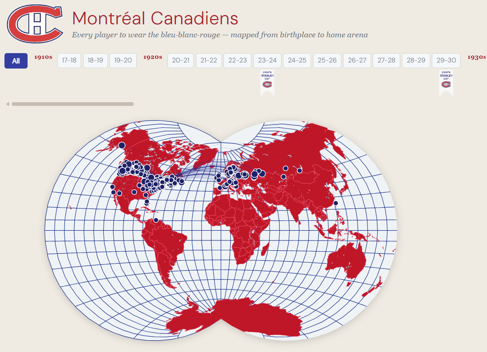

# Montréal Canadiens — Player Birthplace Globe

An interactive world map visualising every player to wear the *bleu-blanc-rouge*, tracing the arc from their birthplace to the Canadiens' home arena for that season.



---

## Features

- **Season timeline** — scroll through every NHL season from 1917–18 to the present; Stanley Cup championship seasons are marked with a banner beneath the button
- **Van der Grinten IV projection** — a classic cartographic map used to resemble the Habs globe logo during the 1924/1925 season
- **Birthplace arcs** — geodesic lines connect each player's birthplace to the arena used that season
- **Player dots** — clustered by exact birthplace; dot size reflects the number of players from that city
- **Hover tooltip** — headshot, jersey number (NHL-Montreal font), name, birthplace, and birthdate
- **Pinned cluster tooltip** — tap/click a cluster to lock it open and browse all players from that city
- **Player detail panel** — full stats panel with headshot, personal info, and season or career totals
- **Career totals** — when viewing "All seasons", the panel shows MTL career GP / G / A / PTS / ±/ PIM (or GP / W / L / GAA / SV% / SO for goalies) across all seasons
- **Zoom & pan** — scroll-wheel zoom toward cursor; drag to pan; pinch-to-zoom on touch devices
- **Mobile-responsive** — compact header, reduced timeline, and a full-width bottom-sheet panel on phones

---

## Data

Player data is sourced from the **NHL API** (`api-web.nhle.com`) via a Python pipeline that fetches rosters for every Canadiens season, geocodes birthplaces, and outputs a CSV with one row per player-season.

| File | Description |
|---|---|
| `data/mtl_historical_players.csv` | One row per player-season — stats, birthplace coordinates, headshot URL |
| `data/mtl_arenas.csv` | Arena name, coordinates, and active year range |
| `python/download_mtl_historical.py` | Pipeline script — fetches rosters, geocodes, writes CSV |

### Running the data pipeline

```bash
cd python
pip install requests geopy
python download_mtl_historical.py
```

The script writes `data/mtl_historical_players.csv`. Re-run it any time to refresh rosters or add new seasons.

---

## Tech stack

| Layer | Library |
|---|---|
| UI framework | React 18 + Vite |
| Map & visualisation | D3.js v7 |
| Projection | `d3-geo-projection` — Van der Grinten IV |
| Topology | `topojson-client` + Natural Earth 110m |
| Fonts | NHL-Montreal (local), DM Sans 300 (Google Fonts) |

---

## Getting started

```bash
# Install dependencies
npm install

# Start the dev server (also serves /data/ via a custom Vite plugin)
npm run dev

# Build for production
npm run build
```

Open [http://localhost:5173](http://localhost:5173) in your browser.

> **Note:** The dev server must be running for the CSV data files to load — they are served via a custom middleware plugin in `vite.config.js` that maps `/data/*` requests to the project-root `data/` folder.

---

## Project structure

```
├── data/
│   ├── mtl_historical_players.csv
│   └── mtl_arenas.csv
├── public/
│   ├── fonts/
│   │   └── NHL Montreal Regular.ttf
│   ├── favicon-ch.svg
│   └── Logo_Canadiens_de_Montréal_1926-1952.svg
├── python/
│   └── download_mtl_historical.py
└── src/
    ├── Globe.jsx      # D3 map, interactions, player panel
    ├── Globe.css      # All styles including mobile media query
    ├── App.jsx
    └── main.jsx
```

---

*Go Habs Go.*
